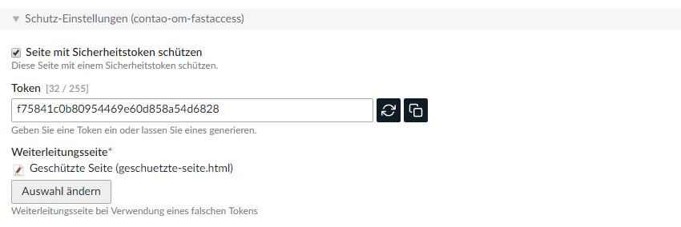

# Handbuch - Contao-OM-Fastaccess

## Ziel

Das vorliegende Bundle ist eine Erweiterung für das Open-Source-Content-Management-System Contao. Es ermöglicht den Zugriffsschutz einzelner Seiten mittels Token. Somit sind kein Benutzername und Passwort notwendig.


## Systemvoraussetzungen

* Contao 4.4+


## Installation

Die Installation erfolgt mittels composer.

```
composer require omosde/contao-om-fastaccess
```


## Funktionsweise

Das Bundle ergänzt in den Einstellungen zu jeder Seite entsprechende Felder. Nachfolgend im Screenshot zu sehen.



### Seite schützen

Fügt zu dieser Seite einen Schutz hinzu. Die notwendigen Felder werden eingeblendet.

### Token

Das Token kann mittels des 'Refresh'-Buttons automatisch neue Token generieren. Der 'Kopieren'-Button kopiert eine URL der zugehörigen Frontend-Seite ins Clipboard. Die URL steht somit anschliessend per 'Strg+V' zur Verfügung. Das Token kann aber auch selbst vergeben werden.

### Weiterleitungsseite

Hier wird eine Seite angegeben, auf die direkt weitergeleitet wird, falls der verwendete Token nicht mit der Vorgabe übereinstimmt.


## Hinweise:

* als Weiterleitungsseite darf keine Seite ausgewählt werden, welche ebenfalls mittels diesem Bundle geschützt ist
* als Weiterleitungsseite darf ebenso die bearbeitete Seite nicht gewählt werden

* Das Bundle ist nicht für ein Update der bisherigen Contao-Erweiterung "om-fastaccess" vorgesehen. Es mag gehen, getestet ist es aber nicht.


## Plugins

Das Bundle nutzt intern [clipboard.js][1] für die Kopierfunktion.

[1]: https://clipboardjs.com/
